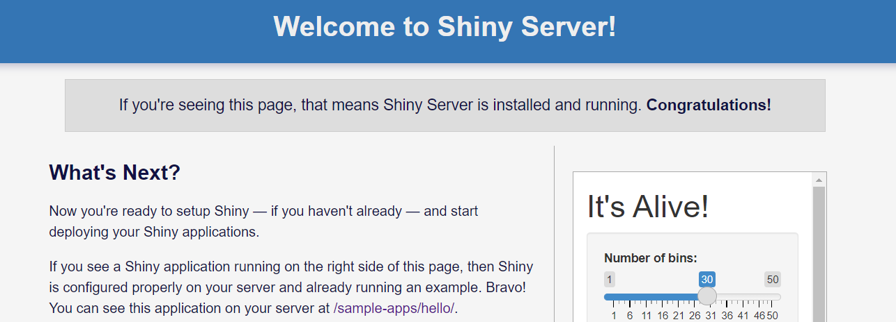
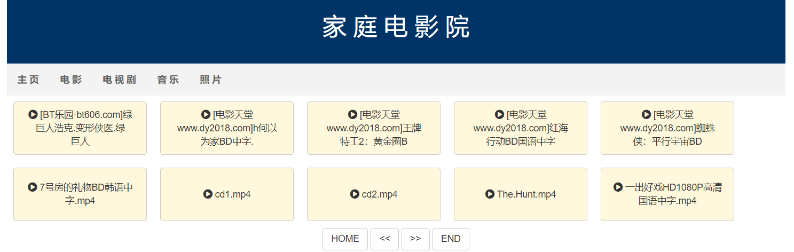
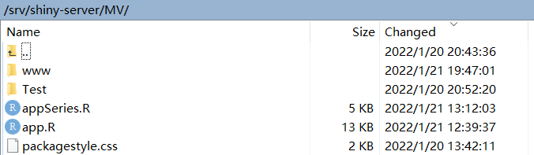

# HomeMV
A `home MV` developed by dming1024 based on R Shiny and shiny server.
利用R、shinyserver，在局域网内搭建了一个视频播放的server。

## Introductions

### Home Page
if you visit this ip address(you server machine ip) and have this page, which means shiny server is runing on your server.

### Move List
Next,you need to develope a shiny App. Here we call it HomeMV, the following is its home page:

### Move Player
The overview of movies. Besides,you can swich to the player page, just to simply click the button with movies names.
	

## Usage

### Git Clone
First, you need to `git clone` this project to get app,and then deployed this app server on your shiny server, whose location may like this: `/srv/shinyserver/`
	

### Add Moves
Second, you have to `copy` or `soft link` you movies to this directions: `/srv/shinyserver/MV/www`

## Discussion

If you have questions in usage, please feel free to connect me(dongliulou@gmail.com), thanks~